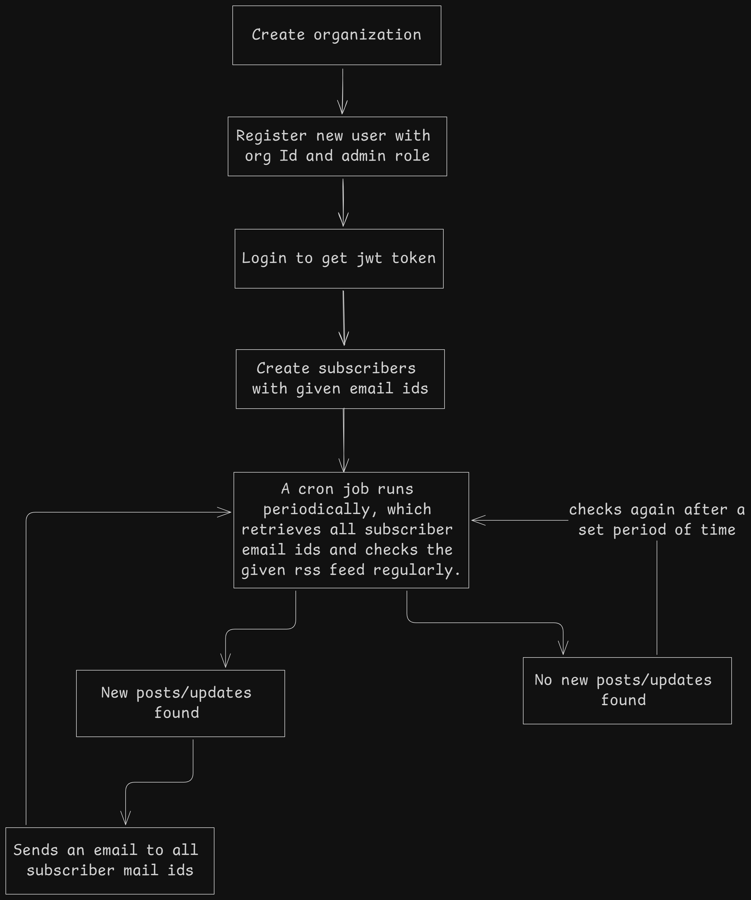

# RSS Campaign Feature


## Workflow



- Created an organization (by temporarily disabling auth guard)
- Registered a new user using the created org's id and with 'admin' role
- Logged in to get the jwt token for accessing the create subscriber endpoint
- Created subscribers using required email ids
- Cron job runs periodically (currently runs every day at midnight) to check the required rss feed url. If new content/updates are found, it creates a campaign, creates a clickStat for each feed Item that will be sent, retrieves a list of all subscriber email ids and sends each an email (used Sendgrid) with the recently published feed items.
- If no feed items are found, it checks again at it's designated time.

## Misc

#### Admin user login credentials - 
Can be used to test on the deployed backend service and directly create a subscriber.

```json
{
  "email": "default@email.com",
  "password": "string"
}
```
